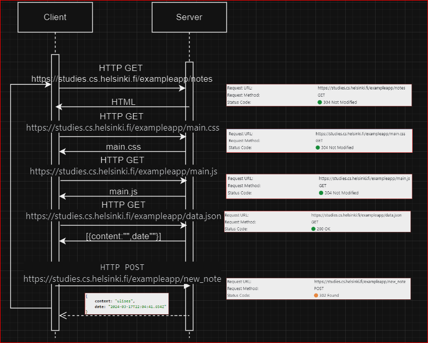

# EXERCISE 0.4

This image shows how 'https://studies.cs.helsinki.fi/exampleapp/notes' works when you add a note.

The server sends HTML, CSS, JS and JSON. If the user adds a note, it sends POST request, and the server responds by adding the content from the form to the .json file and the browser executes again the page.

