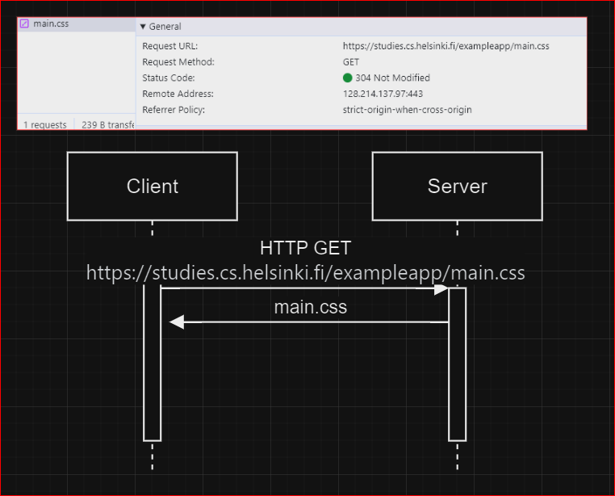
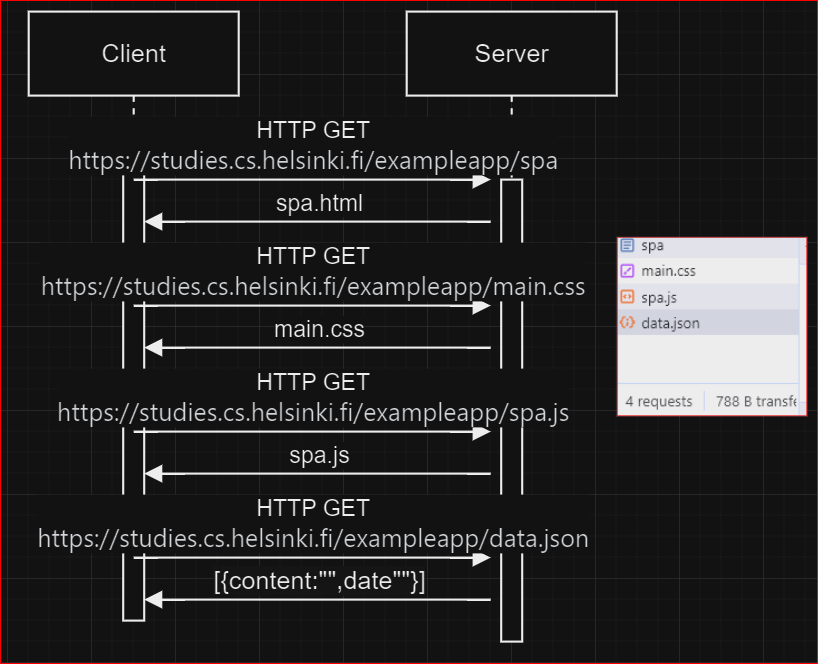

# EXERCISE 0.5

This exercise discusses the behavior observed when opening the SPA (Single Page Application) for the first time, where the only GET request made is for the CSS. I have created a diagram to illustrate this initial interaction.

Upon reloading the SPA, it triggers another GET request as demonstrated in the following diagram.

